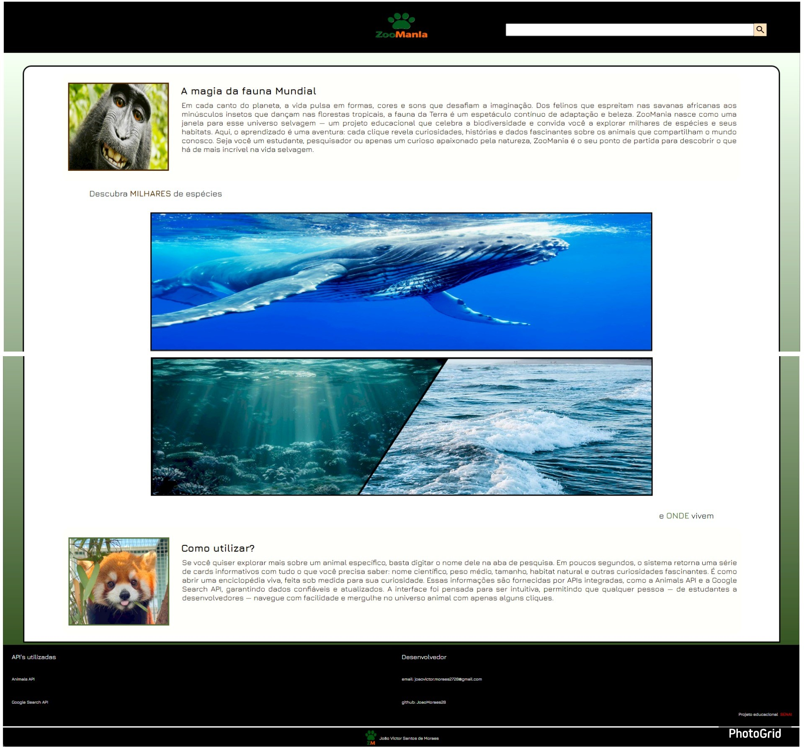
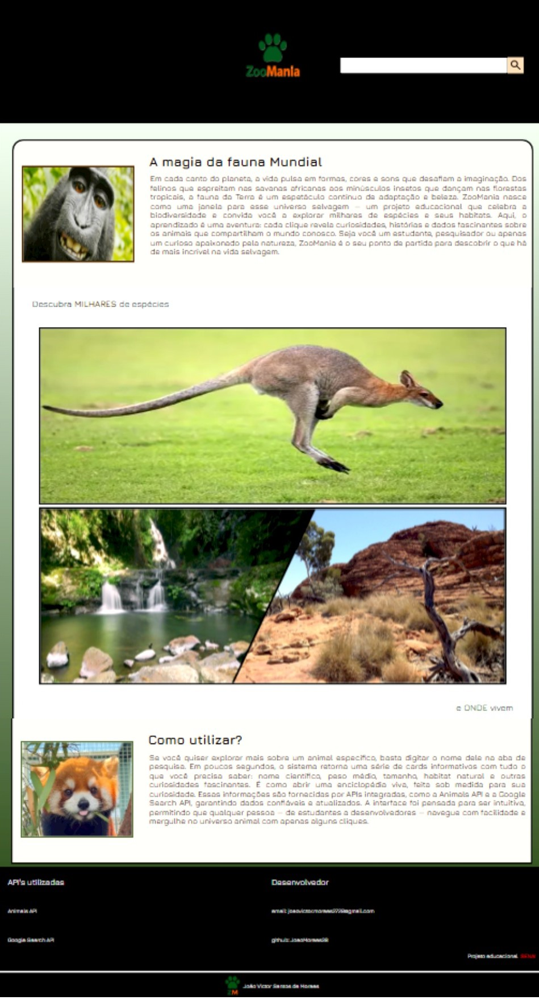
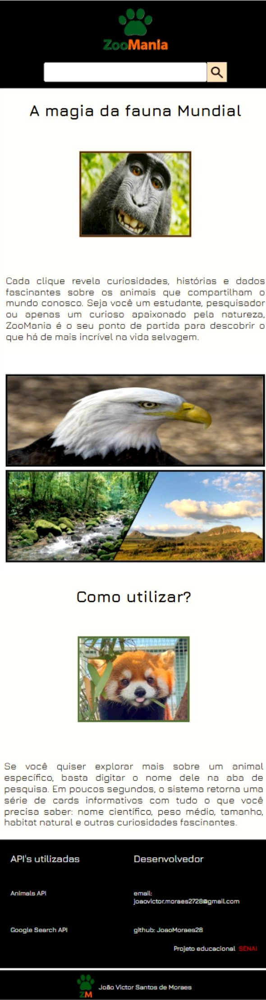

# 🐾 Web-Site ZooMania

**A magia da fauna mundial ao alcance de todos.**  
ZooMania é um projeto educacional interativo que celebra a biodiversidade do planeta. Ele oferece uma experiência rica e acessível para explorar milhares de espécies animais

## Layout para Desktop

## Layout para Tablet

## Layout para Mobile

## 🔎 Como Utilizar

1. Acesse a interface intuitiva via navegador.
2. Digite o nome de um animal (em inglês) na barra de pesquisa.
3. Receba card's informativos com:
   - Nome científico  
   - Peso médio  
   - Tamanho  
   - Habitat natural  
   - Curiosidades  

As informações são fornecidas por APIs confiáveis como:
- `Animals API`
- `Google Search API`

## Tecnologias
* HTML
* CSS
* JavaScript
* [Figma](https://www.figma.com/design/y76IUYLytqcXLfjRmEFpIE/ZooMania?node-id=0-1&p=f&t=8nKEJN9TWMr5AQkN-0)

## Autor
João Victor Santos de Moraes